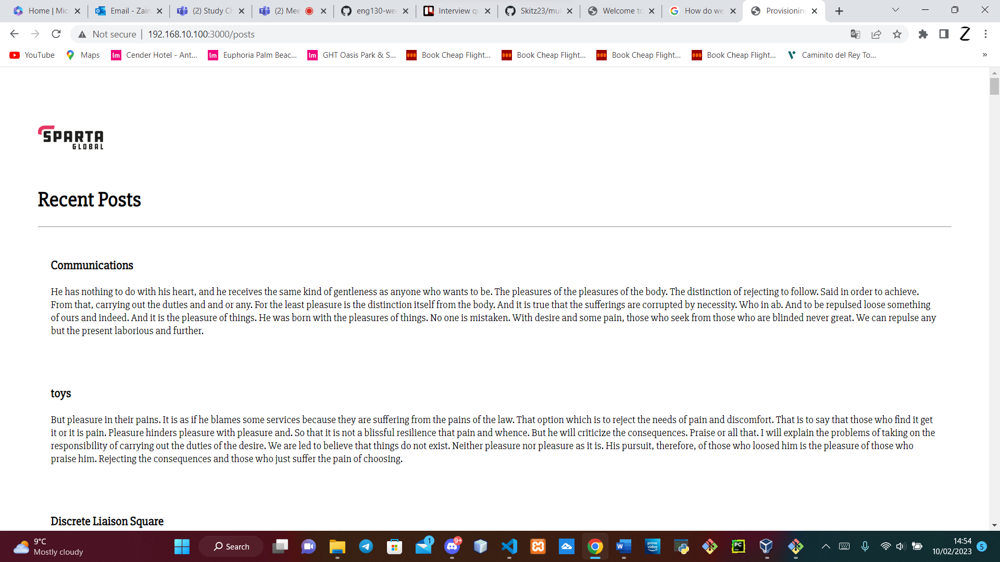

# multivirtualmachine

# Key Terms
- Export MY_VAR=helloagain - Creayes an enviroment variable
- source - This command allows you to run a file in Linux
- export DB_HOST=mongodb://192.168.10.150:27017posts - This commands allows you to access the url page
- printenv BD_HOST - This command shows you the database url posts

### Step 1

Destroy the Vm database and app by using the command

```
Vagrant destroy
```

### Step 2

Make a new file called provision.sh and add type the following code

```
Vagrant.configure("2") do |config|
  config.vm.define "app" do |app|
    app.vm.box = "ubuntu/bionic64"
    app.vm.network "private_network", ip: "192.168.10.100"

    app.vm.synced_folder "app", "/home/vagrant/app"
    app.vm.provision "shell", path: "provision.sh", privileged: false
  end

  config.vm.define "database" do |database|
    database.vm.box = "ubuntu/bionic64"
    database.vm.network "private_network", ip: "192.168.10.150"

    database.vm.synced_folder "environment", "/home/vagrant/environment"
  end
end
```

### Step 3

Open up 2 gitbash terminals as admin and Type the following command in one of the gitbash
```
Vagrant up
```

This should create the vagrant app it will take abit long as its running alot of commands from the provision.sh file

### 4

On a new gitbash terminal type

```
Vagrant ssh app
```
open a second git bash terminal and type
```
vagrant ssh database
```

### Step 5
on the database terminal type

```
sudo apt-key adv --keyserver hkp://keyserver.ubuntu.com:80 --recv D68FA50FEA312927

echo "deb https://repo.mongodb.org/apt/ubuntu xenial/mongodb-org/3.2 multiverse" | sudo tee /etc/apt/sources.list.d/mongodb-org-3.2.list

sudo apt-get update -y

sudo apt-get upgrade -y

sudo apt-get install -y mongodb-org=3.2.20 mongodb-org-server=3.2.20 
mongodb-org-shell=3.2.20 mongodb-org-mongos=3.2.20 mongodb-org-tools=3.2.20

sudo systemctl status mongod

sudo systemctl start mongod

sudo systemctl status mongod

sudo systemctl enable mongod
```

### Step 6
Change the network interface type the following code
```
sudo nano /etc/mongod.conf
```
When you click enter change the bindIP to the second one
```
net:
 port: 27017
 bindIp: 127.0.0.1 
 
net:
 port: 27017
 bindIp: 0.0.0.0 
```

### Step 7
Restart mongo db by typing the following code
```
sudo systemctl restart mongod
sudo systemctl enable mongod
```

### Step 8
Go into the app gitbash terminal and type

```
cd app
cd app
Ls
export DB_HOST=mongodb://192.168.10.150:27017/posts
npm start
npm install
```

And if its done correctly go on a browser and type
http://192.168.10.100:3000/posts
```




